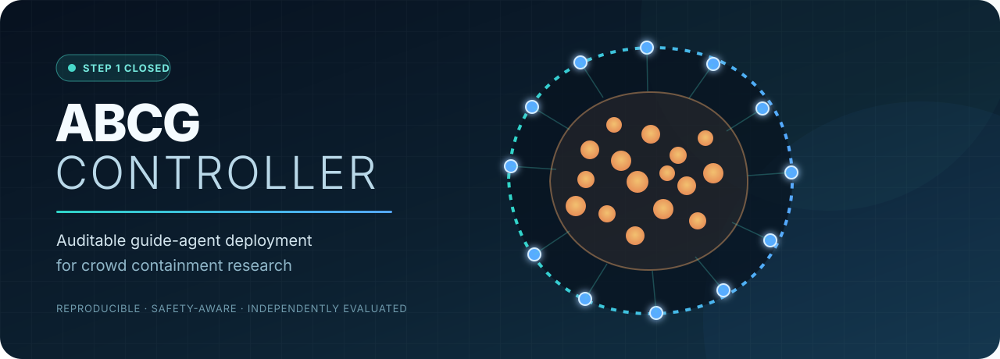
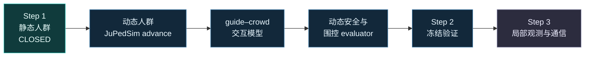

<div align="center">
  
</div>

<div align="center">
  <br />
  <a href="docs/step1_validation.md"></a>
  <a href="https://github.com/Wu-kaixin/ABCG-controller/actions/workflows/ci.yml"></a>
  <a href="pyproject.toml"></a>
  <a href="LICENSE"></a>
</div>

<p align="center">
  <strong>在未知人群轮廓外，安全、可复现地部署引导代理。</strong><br />
  <sub>Safe, reproducible guide-agent deployment around an unknown crowd boundary.</sub>
</p>

<p align="center">
  <a href="#-快速开始">快速开始</a> ·
  <a href="#-系统架构">系统架构</a> ·
  <a href="#-方法与协议">方法与协议</a> ·
  <a href="#-验证证据">验证证据</a> ·
  <a href="#-step-2-路线图">Step 2</a>
</p>

---

ABCG Controller 是一个面向人群围控研究的可审计实验框架。当前版本完成了 **Step 1：单个静态人群、无 guide–crowd 动力学交互、无通信限制**，涵盖边界估计、周期部署、绕障分配、安全运动、停滞恢复以及从落盘轨迹出发的独立验收。

<table>
  <tr>
    <td width="25%" align="center"><strong>7,216 / 7,216</strong><br /><sub>冻结任务完成</sub></td>
    <td width="25%" align="center"><strong>0</strong><br /><sub>实验执行错误</sub></td>
    <td width="25%" align="center"><strong>7,216 / 7,216</strong><br /><sub>离线复判一致</sub></td>
    <td width="25%" align="center"><strong>29 / 29</strong><br /><sub>测试通过</sub></td>
  </tr>
</table>

> [!NOTE]
> **CLOSED 是有边界的工程结论。** 它不表示动态人群遏制、真实机器人安全、全局最优或任意初态必达。精确定义见[理论与结论边界](docs/step1_theory.md)。

## ✨ 为什么使用 ABCG

| | 能力 | 说明 |
|---|---|---|
| 🧭 | **保守几何建模** | 从带半径的人群观测构建占据包络和安全部署曲线 |
| ⚙️ | **多种部署策略** | Equal Arc、Average CVT、Mass CVT、DistMesh-inspired |
| 🛡️ | **连续区间安全复核** | 检查 guide–guide、guide–human 与 guide–wall 净间距 |
| 🧩 | **静态绕障分配** | visibility graph、Dijkstra、路径代价匹配与可达性检查 |
| 🔁 | **有限停滞恢复** | 路径重算 → 可达重分配 → 确定性优先级让行 |
| 🔬 | **独立轨迹验收** | 不相信 controller 的内部成功标志，从保存轨迹重算九类 criteria |
| 🔐 | **可追溯与可恢复** | commit/source/config/input/task hash、原子状态与安全 resume |

## 🚀 快速开始

需要 **Python 3.12+**。

```bash
git clone https://github.com/Wu-kaixin/ABCG-controller.git
cd ABCG-controller
python -m venv .venv
```

<details open>
<summary><strong>Linux / macOS</strong></summary>

```bash
source .venv/bin/activate
python -m pip install --upgrade pip
python -m pip install -e ".[dev]"
python run.py --config configs/step1/square.yaml --output results/quickstart
```

</details>

<details>
<summary><strong>Windows PowerShell</strong></summary>

```powershell
.\.venv\Scripts\Activate.ps1
python -m pip install --upgrade pip
python -m pip install -e ".[dev]"
python run.py --config configs/step1/square.yaml --output results/quickstart
```

</details>

重新验证或绘制已经保存的结果：

```bash
python run.py --reevaluate results/quickstart
python visualization.py --result results/quickstart
```

输出目录包含输入快照、严格 JSON 指标、规划历史、原子状态、无 pickle 的 NPZ 轨迹和可选场景图。

## 🧠 系统架构


### Step 1 的系统假设

| 人群 | 交互 | 观测 | 通信 | 环境 |
|---|---|---|---|---|
| 单个、静态 | guide 不改变人群动力学 | 全局快照 | 集中且不受限 | 已知封闭场地 |

## 🧮 方法与协议

### 部署方法

| 方法 | CLI | 主要用途 |
|---|---|---|
| **Equal Arc** | `equal_arc` | 沿部署曲线等弧长分布 |
| **Average CVT** | `average_cvt` | 几何密度驱动的周期 CVT |
| **Mass CVT** | `mass_cvt` | demand 权重驱动的覆盖分布 |
| **DistMesh-inspired** | `distmesh` | 相邻间距均衡迭代 |

### 资源协议

```bash
# 在资源上限内有界搜索 guide 数量
python run.py --config configs/step1/square.yaml --output results/adaptive \
  --method equal_arc --protocol adaptive_resource

# 固定 guide 数量，适合公平方法对照
python run.py --config configs/step1/square.yaml --output results/fixed-24 \
  --method equal_arc --protocol fixed_n --fixed-n 24
```

多 seed 并行：

```bash
python run.py --config configs/step1/square.yaml --output results/batch \
  --seeds 0 1 2 3 4 --workers auto --no-plots
```

追加 `--resume` 可继续中断任务。只有全部复现哈希匹配且结果完整的任务才会跳过。

## ✅ 验证证据

| Gate | 结果 |
|---|---:|
| 单元、集成与反例测试 | **29/29 PASS** |
| 最终冻结任务 | **7216/7216 completed** |
| 冻结终止语义 | **7216/7216 matched** |
| 实验执行错误 | **0** |
| 保存轨迹离线复判 | **7216/7216 consistent** |
| 缺失 task hash | **0** |
| 净安全间距低于 `-1e-7` | **0** |

其中 5342 个任务以 `SUCCESS` 结束；其余任务诚实保留为结构化的容量不足、非法偏移、路径不可达、初始化无效或规划搜索耗尽，而不是被删除或包装成成功。

<p align="center">
  <a href="docs/step1_validation.md"><strong>阅读完整验收报告 →</strong></a>
  &nbsp;&nbsp;·&nbsp;&nbsp;
  <a href="experiments/final_validation_summary.json">查看机器摘要</a>
</p>

<details>
<summary><strong>复现验证矩阵</strong></summary>

```bash
python -m pytest -q
python experiments/validation_runner.py --output results/smoke \
  --phase development --smoke --workers auto
python experiments/validation_runner.py --output results/development \
  --phase development --workers auto
python experiments/validation_runner.py --output results/validation \
  --phase validation --workers auto
python experiments/validation_runner.py --output results/validation --reevaluate
python experiments/validation_runner.py --output results/validation --plot-only
```

完整矩阵计算量较大。冻结的场景、seed、方法、协议和 gates 见 [`acceptance_manifest.yaml`](experiments/acceptance_manifest.yaml)。

</details>

## 🗺️ Step 2 路线图

`main` 保存已验收的 Step 1 基线，`develop` 是 Step 2 的集成分支。



Step 2 仍保持全局观测和无限通信；局部观测与邻居通信属于 Step 3。

## 📁 仓库导航

<table>
  <tr>
    <td><a href="controller"><strong>controller/</strong></a><br /><sub>边界、覆盖、导航、安全和总体控制</sub></td>
    <td><a href="configs/step1"><strong>configs/step1/</strong></a><br /><sub>基准场景与验收夹具</sub></td>
  </tr>
  <tr>
    <td><a href="experiments"><strong>experiments/</strong></a><br /><sub>冻结 manifest、runner 与机器摘要</sub></td>
    <td><a href="tests"><strong>tests/</strong></a><br /><sub>单元、集成和反例测试</sub></td>
  </tr>
  <tr>
    <td><a href="evaluator.py"><strong>evaluator.py</strong></a><br /><sub>与 controller 解耦的轨迹验收</sub></td>
    <td><a href="run.py"><strong>run.py</strong></a><br /><sub>单次、批量、resume 与复判入口</sub></td>
  </tr>
</table>

### 深入阅读

- [Step 1 最终验收报告](docs/step1_validation.md)
- [Step 1 状态与需求映射](docs/step1_status.md)
- [理论、实现和结论边界](docs/step1_theory.md)
- [机器可读验证摘要](experiments/final_validation_summary.json)

---

<p align="center">
  Built for reproducible crowd-guidance research.<br />
  Released under the <a href="LICENSE">MIT License</a>.
</p>
